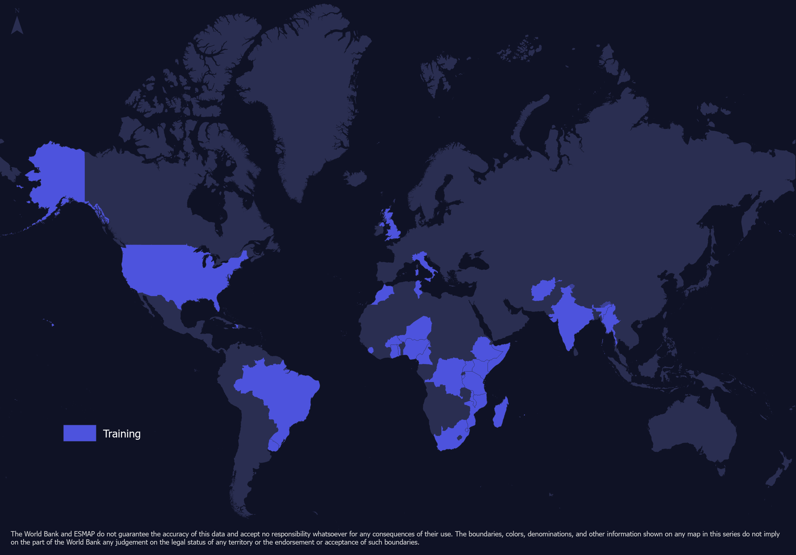

# Capacity Building

Capacity Building is a main pillar of the Global Electrification Platform (GEP) Initiative. Open-source tools and data are emphasized for the training as they play a crucial role in national energy modelling capabilities needed by countries to achieve universal access to modern energy services by 2030 (SDG7).  

The capacity building activities are focused on geospatial across governments, development partners and private sector agents. The GEP team has run four capacity building events and has established an annual training in Trieste, Italy in June. If you are interested in participating in the training as either a participant or as a trainer, please do not hesitate to contact the [GEP Team](https://gep-user-guide.readthedocs.io/en/latest/Contact.html). 

## Past Capacity Building Activities
So far, the following capacity building activities have been hosted as part of this initiative: 
1. Ethiopia, Addis Ababa, January 2018  
2. [Italy, Trieste, June 2018](https://global-electrification-platform.github.io/User_Guide/user-manual/source/PDFs/Summary_SDSS_Trieste2019_public_version.pdf)  
3. [South Africa, Cape Town, January 2019](https://global-electrification-platform.github.io/User_Guide/user-manual/source/PDFs/Summary_EMP-A_2019_public_version.pdf)  
4. [Italy, Trieste, June 2019](https://global-electrification-platform.github.io/User_Guide/user-manual/source/PDFs/Summary_SDSS_Trieste2019_public_version.pdf)  
5. Online Capacity Building in Somalia, May 2021
6. [ICTP Online Summer School, June 2021](http://indico.ictp.it/event/9549/)

Close to 100 trainees have already participated in the regional trainings co-hosted by the World Bank. Most of the trainees are from Sub Saharan Africa (SSA). In total, participants from more than 30 different countries have received training so far. Ranging from Haiti, Myanmar, Sierra Leone to Burundi

**Capacity building efforts since 2018**

## Open Access Course at Open University

The [Climate Compatible Growth](https://climatecompatiblegrowth.com/) (#CCG) program together with the UN, the World Bank and other International Organizations have developed a collection of online courses aiming at developing capacity for better evidence-based policy making with analysts and academics from across the world. One of the courses focuses on energy access modelling and more specifically, on the Global Electrification Platform and OnSSET. 

In this course one can learn about energy access modelling and how to conduct a geospatial electrification analysis. The course serves as an introduction to the Open Source Spatial Electrification Tool (OnSSET) and offers a unique opportunity to learn about spatial data collection, cleaning, curation and use into electrification modelling. After the completion of the course, one will be able to better undestand the basic concepts of geospatial electrification modelling, build a country model from scratch and explore custom-developed electrification investment roadmaps.

All material is open source and has been developed by forward-looking organizations, who know the importance of community accessibility, continuous improvement, and accountability.

Learn more about this course [here](https://www.open.edu/openlearncreate/course/view.php?id=6816).