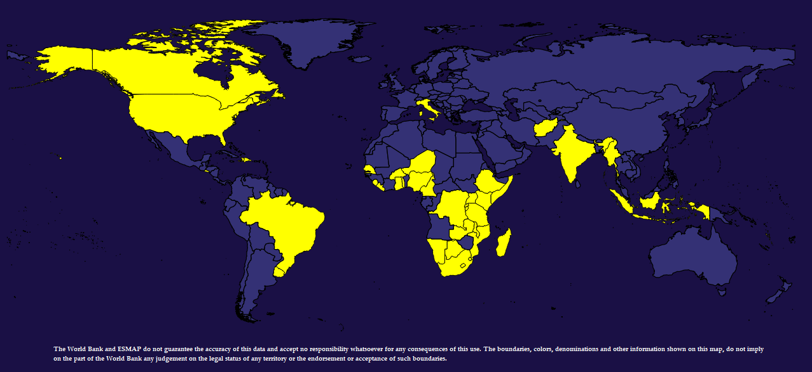
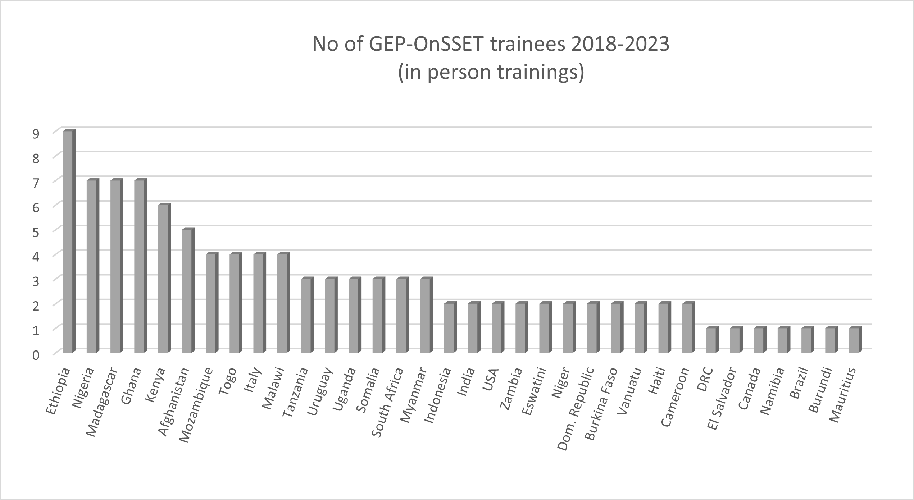

# Capacity Building

Capacity Building is a crucial component of the Global Electrification Platform (GEP). The GEP team has conducted 15 workshops since 2018 primarily through three annual events: the Energy Modelling Platform for Africa (EMPA), the Energy Modelling Platform for Latin America and the Caribbean (EMPLAC) and the Energy Modelling Platform Global (EMPG) at ICTP (see detailed list below). 

The goal of these events is to increase geospatial analytics and modelling capacity across government units, academia, development partners and private sector that are actively angaged in planning, policy & decision-making for achieving critical development targets, like SDG7.

 If you are interested in participating in these events - either as trainer or trainee - please do not hesitate to contact the [GEP Team](https://gep-user-guide.readthedocs.io/en/latest/Contact.html). 

## Past Capacity Building Activities
So far, the following capacity building activities have been hosted as part of this initiative: 
1. [EMPA -- Ethiopia, Addis Ababa, January 2018](http://www.energymodellingplatform.org/emp-a-2018.html)
2. [ICTP Summer School -- Italy, Trieste, June 2018](https://global-electrification-platform.github.io/User_Guide/user-manual/source/PDFs/Summary_SDSS_Trieste2019_public_version.pdf)  
3. [EMPA -- South Africa, Cape Town, January 2019](http://www.energymodellingplatform.org/emp-a-2019.html)  
4. [ICTP Summer School -- Italy, Trieste, June 2019](https://global-electrification-platform.github.io/User_Guide/user-manual/source/PDFs/Summary_SDSS_Trieste2019_public_version.pdf)  
5. Online Capacity Building in Somalia, May 2021
6. [ICTP Summer School (Virtual training), June 2021](http://indico.ictp.it/event/9549/)
7. [EMPA (Virtual training), November 2021](http://www.energymodellingplatform.org/emp-a-2021.html)  
8. [ICTP Summer School (Virtual training), June 2022](https://indico.ictp.it/event/9879/)
9. [EMPLAC (Virtual Training), October 2022](https://climatecompatiblegrowth.com/wp-content/uploads/2023-EMP-LAC-concept-note-english.pdf)
10. [EMPA -- Namibia, Windhoek, April 2023](https://climatecompatiblegrowth.com/wp-content/uploads/EMP-A-2023-Concept-Note.pdf)
11. [ICTP Summer School -- Italy, Trieste July 2023](https://indico.ictp.it/event/10186#:~:text=Secretariat%3A&text=The%20Joint%20Summer%20School%20on,from%203rd%20July%20to%2014th.)
12. [EMPLAC (Virtual Training), January 2024](https://climatecompatiblegrowth.com/wp-content/uploads/Concept-Flyer-for-Summer-School_20230824.pdf)
13. [EMPA -- Ghana, Accra, May 2024](https://climatecompatiblegrowth.com/emp-a-2024/)
14. [EMPG -- Italy, Trieste August 2024](https://indico.ictp.it/event/10501)

As of July 2024, 130 trainees from 40 countries have completed the GEP-OnSSET training. About 70% of the trainees are working as electrification & policy analysts in government agencies and institutions; about 20% are coming from academia and research organizations and the remaining 10% from development organizations and the private sector. Most of the participants are from Sub-Saharan Africa; trainees from Latin America & the Caribbean and Southeast Asia & the Pacific and other regions have also participated over the years.

**GEP-OnSSET capacity building efforts between 2018-2024**

## Open Access Course at Open University

The [Climate Compatible Growth](https://climatecompatiblegrowth.com/) (#CCG) program together with the UN, the World Bank and other International Organizations have developed a collection of online courses aiming at developing capacity for better evidence-based policy making with analysts and academics from across the world. One of the courses focuses on energy access modelling and more specifically, on the Global Electrification Platform and OnSSET. 

In this course one can learn about energy access modelling and how to conduct a geospatial electrification analysis. The course serves as an introduction to the Open Source Spatial Electrification Tool (OnSSET) and offers a unique opportunity to learn about spatial data collection, cleaning, curation and use into electrification modelling. After the completion of the course, one will be able to better undestand the basic concepts of geospatial electrification modelling, build a country model from scratch and explore custom-developed electrification investment roadmaps.

All material is open access and has been developed by forward-looking organizations, who know the importance of community accessibility, continuous improvement, and accountability.

Learn more about this course [here](https://www.open.edu/openlearncreate/course/index.php?categoryid=1267).