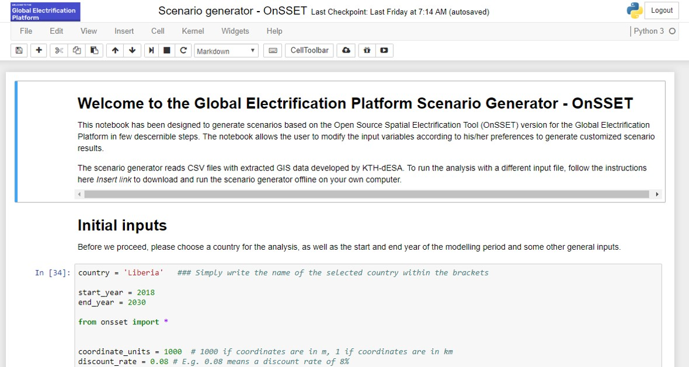
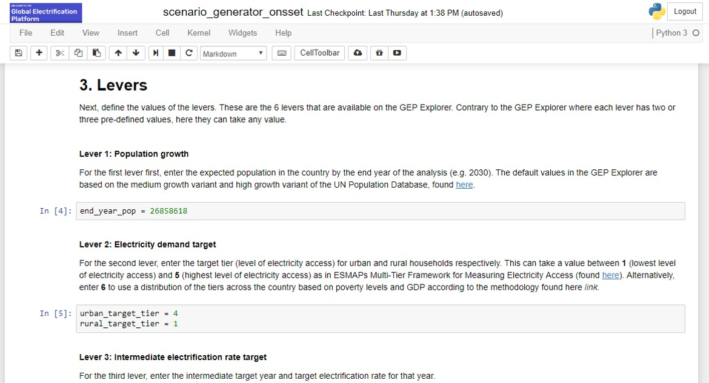

The GEP Scenario Generator
==================================

Overview
************************************

Replicability and reproducibility are key components of the GEP. The GEP “Scenario Generator” provides policy analysts with a tool to re-generate or modify investment electrification scenarios using an interactive interface. The GEP “Scenario Generator” is a version of the Open Source Spatial Electrification Tool (`OnSSET.org <http://www.onsset.org/>`_) developed as a Jupyter notebook.

Here, the users are able to replicate the electrification investment scenarios available in the GEP “Explorer”. They can also develop their own scenarios – and visualize them independently. This allows building custom scenarios that better match local specificities or specific policy measures i.e. borrowing options, technology purchases, formulating concession programs, and subsidies.

.. note::
        The GEP “Scenario Generator” can be ran locally on the user’s computer without any dependency on online servers.

Target Audience & Objective
-------------------------------

The GEP “Scenario Generator” aims to support specific key services:

1. Capacity building activities:

    a. Integrated into annual trainings: ICTP Global Summer School / Energy Modelling Platform(s) to provide a basic introduction to geo-spatial electrification training.
    b. Implemented in training and outreach with analysts in-country as part of new and ongoing electrification projects
    c. Become one of several key components in the OpTIMUS.community global Micro-Masters

2. Driver of development:

    a. Provides analysts with the ability to move beyond pre-cooked results provided in the GEP “Explorer” to more nuanced scenarios. Scenarios that are flexible to conditional national constraints for goals: developing detailed policy, engaging with financiers, exploring technology deployment and market potentials etc.
    b.  Being cost-free enables the GEP community to develop first order electrification plans rapidly at a drastically reduced cost. These can be used in country engagement activities.

Access GEP "Scenario Generator" services
*********************************************

A pilot version of **The GEP "Scenario Generator"** is available `here. <https://github.com/KTH-dESA/The-GEP/tree/The-GEP-Scenario-Generator>`_

