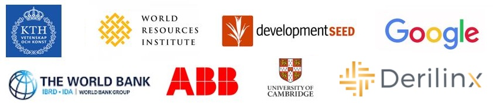

Welcome to The GEP User's Guide!
===============================================

The Global Electrification Platform (GEP)
+++++++++++++++++++++++++++++++++++++++++
The 2030 Agenda for Sustainable Development has set the goal of universal access to electricity by 2030 (SDG7). The challenge involves bringing electricity to populations with various socio-economic backgrounds and needs. Despite remarkable progress in the past years, energy access gaps still exist.

Coping with dilemmas of this nature requires thorough analysis of the social, technical and economic characteristics of each target location. This, in turn, requires access to reliable data and information e.g., location of population settlements, electricity demand levels, resource availability, poverty rate and economic activity, distance from functional infrastructure etc. Geographic Information Systems (GIS) and remote sensing techniques are becoming openly available and can now provide a range of location-specific information that has not been previously accessible.

Under this framework, **The World Bank** in collaboration with **KTH Division of Energy Systems Analysis**, **Development Seed**, **World Resources Institute (WRI)**, **Cambridge university**, **Google** and **ABB** have developed the Global Electrification Platform (GEP). The following sections provide a brief overview.

Contents
+++++++++++++++++++++

.. toctree::
   :maxdepth: 3

   Overview
   The GEP Explorer
   The GEP Scenario Generator
   The GEP Toolbox
   Interoperability
   FAQ
   Contact
   License

